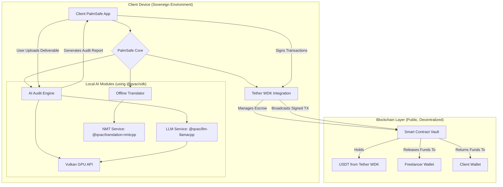

---

# **PalmSafe (Sovereign AI Escrow Edition)**
**Tether Frontier Hackathon - Official Submission**

**Author:** Ibrahem Yaseen Mrhij  
**Track:** Tether  
**Identity:** `palm-safe` on Colosseum Frontier Hackathon

---

## **Executive Summary**

PalmSafe is a revolutionary decentralized escrow protocol engineered for the sovereign freelancer. By leveraging the power of on-device Artificial Intelligence and the stability of Tether (USDT), PalmSafe creates a trustless, censorship-resistant, and private environment for executing freelance agreements. Our platform eliminates the need for centralized arbiters, removes exorbitant platform fees, and ensures that all sensitive data, from project files to communications, never leaves the user's device. This is the future of work: sovereign, intelligent, and secure.

---

## **The Core Problem: The Fragility of Digital Trust**

The modern freelance economy is built on a foundation of brittle, centralized trust. Platforms like Upwork, Fiverr, and Toptal, while useful, introduce significant friction and risks:

1.  **High Fees:** Platforms charge 20% or more, eating into the earnings of freelancers and increasing costs for clients.
2.  **Censorship & Deplatforming:** A single report or algorithmic flag can freeze a user's account and livelihood, with little to no recourse.
3.  **Privacy Erosion:** User data, project files, and communication metadata are stored on corporate servers, vulnerable to breaches and surveillance.
4.  **Geographic Exclusion:** Reliance on stable banking infrastructure and high-speed internet excludes talent from regions with economic or technological instability.

PalmSafe is not an iteration of these platforms; it is their replacement.

---

## **The PalmSafe Solution: Protocol-Based, Sovereign Escrow**

PalmSafe combines the stability of the Tether ecosystem with cutting-edge, privacy-first AI to create a self-sovereign escrow system.

-   **Local AI Auditing:** We use a specialized AI to verify that deliverables meet the contract's requirements, running entirely on the user's machine.
-   **USDT Escrow:** Tether's USDT, integrated via the official Tether WDK, acts as the secure, stable, and universal medium of exchange held in a smart contract vault.
-   **Sovereign Intelligence:** Privacy is non-negotiable. The AI auditing and data processing happen locally. No project files, user data, or proprietary information ever touch a PalmSafe server.
-   **Offline Capability:** Essential for resilience, our system can translate and understand contracts offline, ensuring functionality in regions with unreliable internet connectivity.

---

## **System Architecture**

Our architecture is designed around the principles of user sovereignty, privacy, and decentralization.

### **Architectural Flow Diagram**

### **Component Breakdown**

1.  **Client Application:** A lightweight desktop or web application that serves as the user interface for creating contracts, managing escrow, and viewing AI audit reports.

2.  **Sovereign AI Engine:** The heart of PalmSafe's local processing power.
    *   **`@qvac/sdk`:** The core framework that orchestrates our on-device AI services. It provides the APIs to initialize and run the models.
    *   **`@qvac/llm-llamacpp`:** The Large Language Model (LLM) engine. It runs a quantized, efficient model (e.g., Llama, Mistral) directly on the user's hardware to perform tasks like summarizing code, checking for deliverable completeness against a brief, and generating a structured audit report.
    *   **Vulkan API:** To make local AI inference fast and feasible on consumer hardware, we leverage the Vulkan API for GPU acceleration. This allows the LLM to process complex deliverables (like codebases or long-form articles) in seconds, not minutes, without cloud dependency.

3.  **Tether WDK Integration:**
    *   **`wdk.tether.io`:** The official Tether Wallet Development Kit is our bridge to the Tether ecosystem. The PalmSafe client uses the WDK to securely generate wallets, create, sign, and broadcast transactions. This simplifies the complex process of interacting with USDT on various blockchains (e.g., Ethereum, Tron, Solana).

4.  **Offline Translation Module:**
    *   **`@qvac/translation-nmtcpp`:** This module enables the translation of project briefs and contracts without an internet connection. It uses a local Neural Machine Translation model, crucial for cross-border collaborations and for users in low-connectivity areas.

5.  **Smart Contract Vault:** A simple, audited smart contract on the blockchain. Its only functions are to hold USDT from the client, and release it to the freelancer upon the presentation of a valid cryptographic signature (which can only be generated after a successful local AI audit).

---

## **Technical Impact**

PalmSafe’s innovation lies at the intersection of Edge AI, DeFi, and human-centric design.

### **1. Local AI Auditing via Vulkan API**

PalmSafe redefines the audit process. Instead of a slow, expensive, and biased human arbiter or a privacy-violating cloud AI, we use a **local, sovereign AI auditor**.

-   **Process:** The client receives the deliverable. They run the PalmSafe app. The app uses `@qvac/llm-llamacpp` to load the project brief and the deliverable files into the LLM context. Using the **Vulkan API**, the computation is offloaded to the user's GPU, performing a rapid, comprehensive analysis.
-   **Outcome:** The AI generates a standardized, verifiable "Audit Report" confirming the deliverable meets the pre-agreed criteria. A cryptographic hash of this report is used as the key to unlock the USDT from the smart contract vault. This makes the process **trustless, instantaneous, and verifiable**.

### **2. USDT Escrow via Tether WDK**

Stability is essential for payments. Tether (USDT) is the world's most trusted stablecoin, making it the perfect choice for an escrow system.

-   **Integration:** By using the **Tether WDK (`wdk.tether.io`)**, PalmSafe achieves a native, secure, and seamless integration with the Tether ecosystem. Users don't need to manage complex private keys or RPC endpoints; the WDK abstracts this away, providing a simple and secure interface.
-   **Workflow:**
    1.  Client funds the escrow vault with USDT.
    2.  Funds are locked in the smart contract, visible to both parties but inaccessible to anyone else.
    3.  Upon a successful local AI audit, the WDK helps the client's app sign a transaction to release the funds to the freelancer.
    4.  If the audit fails, funds can be returned or a dispute (handled via an optional multi-sig, not mandatory data upload) can be initiated.

### **3. Sovereign Intelligence: Data Never Leaves the Device**

This is our core principle and a radical departure from the status quo.

-   **Privacy by Design:** All AI processing—the LLM analysis, the translation, the report generation—happens in a sandboxed environment on the user's machine. PalmSafe the protocol has **zero access** to the underlying intellectual property, code, or creative work.
-   **Anti-Censorship:** Since the data is local, no centralized entity can scan, block, or deplatform a user based on the content of their work. This provides unprecedented freedom and security for journalists, developers, and artists.

### **4. Offline Capability with `@qvac/translation-nmtcpp`**

We are building for the world, not just for Silicon Valley.

-   **Resilience:** In many regions, such as **Syria**, parts of Africa, and Southeast Asia, internet connectivity is intermittent or heavily censored. PalmSafe is designed to function in these environments.
-   **Use Case:** A client in Germany and a developer in Syria can form a contract. The contract, originally in German, can be translated offline for the developer using **`@qvac/translation-nmtcpp`**. They can work on the project, and the entire escrow and audit process can be synchronized with the blockchain during the brief moments when a connection is available. This makes PalmSafe a tool for **global digital inclusion**.

---

## **Signature**

**Ibrahem Yaseen Mrhij**  
Full-stack Engineer & Journalist  
Building a more private and sovereign future of work.